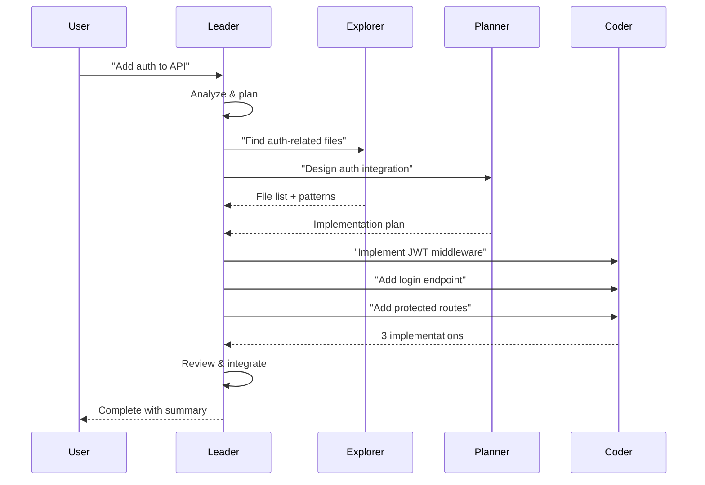

# Leader + Workers Architecture

## Overview

AntCoder implements a **Leader + Workers** pattern where a primary agent (Leader) orchestrates multiple specialized subagents (Workers) to complete complex tasks in parallel.

```
User Request
     │
     ▼
┌─────────────┐
│   LEADER    │  (Orchestrator)
│  • Plans    │
│  • Delegates│
│  • Synthesizes
└──────┬──────┘
       │ spawns
       ▼
┌──────────┬──────────┬──────────┐
│  WORKER  │  WORKER  │  WORKER  │
│  CODER   │ EXPLORER │ PLANNER  │
│  (writes)│ (reads)  │ (plans)  │
└──────────┴──────────┴──────────┘
       │
       ▼
┌─────────────┐
│  RESULTS    │
└─────────────┘
```

## Agent Roles

### Leader Agent
- **Model**: Default `qwen2.5-coder-3b`
- **Responsibilities**:
  - Analyze user request
  - Break into subtasks
  - Spawn appropriate workers
  - Collect and synthesize results
  - Handle errors/retries

### Worker: Coder
- **Model**: `qwen2.5-coder-3b`
- **Tools**: write, edit, bash
- **Focus**: Code generation, refactoring, implementation

### Worker: Explorer
- **Model**: `qwen2.5-coder-1.5b` (faster, smaller)
- **Tools**: read, grep, glob
- **Focus**: Code search, analysis, understanding

### Worker: Planner
- **Model**: `qwen2.5-coder-3b`
- **Tools**: read, write (for plans), todo
- **Focus**: Task decomposition, architecture decisions

## Configuration

```json
{
  "agent": {
    "leaderModel": "local-llama/qwen2.5-coder-3b",
    "workerModels": {
      "coder": "local-llama/qwen2.5-coder-3b",
      "explorer": "local-llama/qwen2.5-coder-1.5b",
      "planner": "local-llama/qwen2.5-coder-3b"
    },
    "maxSubagents": 5,
    "maxDepth": 3
  }
}
```

## Execution Flow



## Parallel Execution

- **Concurrency limit**: `maxSubagents` (default 5)
- **Depth limit**: `maxDepth` (default 3)
- **Per-model semaphore**: Prevents API overload
- **Doom loop detection**: Catches infinite loops

## Example: Refactor Legacy Code

```
User: "Refactor the payment module to use async/await"

Leader:
  1. Spawns Explorer → "Find all payment files"
  2. Spawns Planner → "Design async migration strategy"
  3. Waits for both...
  4. Spawns Coder × 3 → "Migrate file A", "Migrate file B", "Update tests"
  5. Collects results → Runs tests → Reports success
```

## Benefits

| Benefit | Description |
|---------|-------------|
| **Speed** | 3-5x faster on multi-file tasks |
| **Quality** | Specialized models per role |
| **Reliability** | Isolation prevents cascade failures |
| **Scalability** | Add more workers for bigger tasks |

## Tuning Tips

| Scenario | Adjustment |
|----------|------------|
| Low RAM | Reduce `maxSubagents` to 2-3 |
| Simple tasks | Disable workers, use leader only |
| Complex refactor | Increase `maxDepth` to 4-5 |
| Many small files | Use more explorers |
| Heavy computation | Use smaller models for workers |