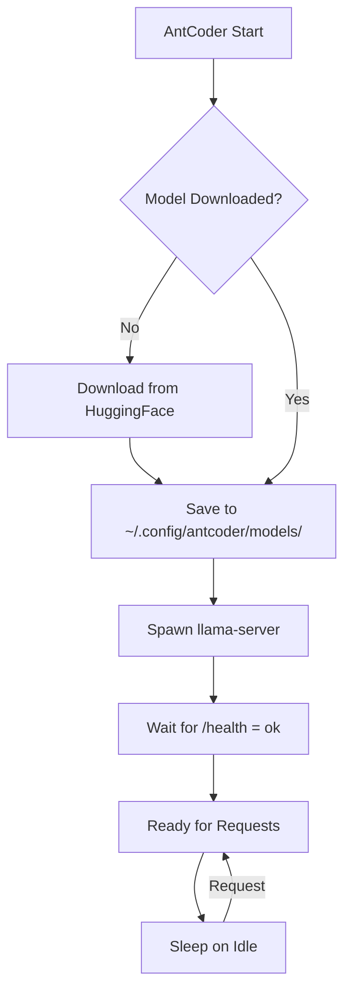

# Local LLM Backend

## Why Local?

| Benefit | Description |
|---------|-------------|
| **Privacy** | Code never leaves your machine |
| **No API Keys** | Zero configuration, no accounts |
| **Offline** | Works without internet |
| **Cost** | $0/month vs $20-500/month cloud |
| **Customization** | Full control over models & params |

## llama.cpp Integration

AntCoder uses **llama-server** (from llama.cpp) as a child process:

```
AntCoder Process
      │
      ├── Spawns llama-server (subprocess)
      │      │
      │      ├── Loads GGUF model into RAM/VRAM
      │      ├── Binds to 127.0.0.1:8080
      │      └── Serves OpenAI-compatible API
      │
      └── Communicates via HTTP
           │
           ├── POST /v1/chat/completions
           ├── GET /health
           └── GET /v1/models
```

## Model Format: GGUF

**GGUF** (GPT-Generated Unified Format) is llama.cpp's quantized model format:

| Aspect | Detail |
|--------|--------|
| Quantization | 4-bit (Q4_K_M) default — 75% size reduction |
| Memory Mapping | mmap() for fast loading, low RAM |
| Hardware Accel | Metal, CUDA, Vulkan auto-detect |
| Context | Up to 32K (model dependent) |

## Model Lifecycle



## Server Configuration

```json
{
  "llamaServer": {
    "port": 8080,
    "contextSize": 4096,
    "gpuLayers": 99,
    "sleepIdleSeconds": 300,
    "modelsDir": "~/.config/antcoder/models"
  }
}
```

| Option | Description | Default |
|--------|-------------|---------|
| `port` | HTTP server port | 8080 |
| `contextSize` | Max context tokens | 4096 |
| `gpuLayers` | Layers on GPU (-1=auto, 0=CPU) | 99 |
| `sleepIdleSeconds` | Unload after idle (0=never) | 300 |
| `modelsDir` | Model storage path | Platform default |

## GPU Acceleration

| Platform | Backend | Flag |
|----------|---------|------|
| macOS (Apple Silicon) | Metal | Auto |
| NVIDIA GPU | CUDA | Auto |
| AMD/Intel GPU | Vulkan | Auto |
| CPU Only | BLAS | `-ngl 0` |

```bash
# Force CPU only
antcoder --gpu-layers 0

# Force all layers on GPU
antcoder --gpu-layers 99

# Specific layers (e.g., 20/32)
antcoder --gpu-layers 20
```

## Memory Requirements

| Model | RAM (CPU) | VRAM (GPU) | Disk |
|-------|-----------|------------|------|
| Qwen2.5-Coder-0.5B | ~1 GB | ~0.8 GB | 0.4 GB |
| Qwen2.5-Coder-1.5B | ~2 GB | ~1.5 GB | 1.0 GB |
| **Qwen2.5-Coder-3B** | **~3 GB** | **~2.2 GB** | **1.85 GB** |
| Qwen2.5-Coder-7B (Q4) | ~6 GB | ~4.5 GB | 4.2 GB |

## Streaming

AntCoder uses Server-Sent Events (SSE) for streaming:

```javascript
// Client → llama-server
POST /v1/chat/completions
{
  "model": "local",
  "messages": [...],
  "stream": true
}

// Server → Client (SSE)
data: {"choices":[{"delta":{"content":"Hello"}}]}
data: {"choices":[{"delta":{"content":" world"}}]}
data: [DONE]
```

## Health & Monitoring

```bash
# Check server health
curl http://localhost:8080/health
# {"status":"ok"}

# List loaded models
curl http://localhost:8080/v1/models

# Server info
curl http://localhost:8080/props
```

## Troubleshooting

| Issue | Solution |
|-------|----------|
| Port 8080 busy | `antcoder --port 8081` |
| OOM on model load | Use smaller model or `-ngl 0` |
| Slow inference | Enable GPU layers, check VRAM |
| Model not found | Check `~/.config/antcoder/models/` |
| Server won't start | Check llama.cpp version compatibility |